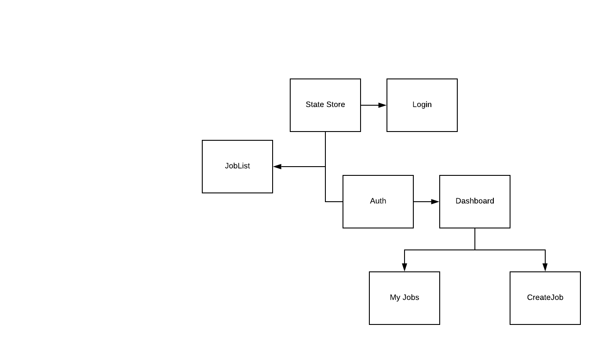
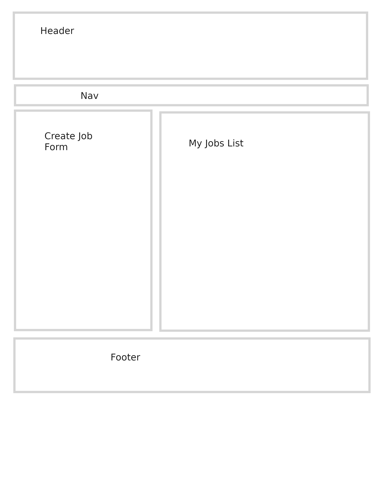
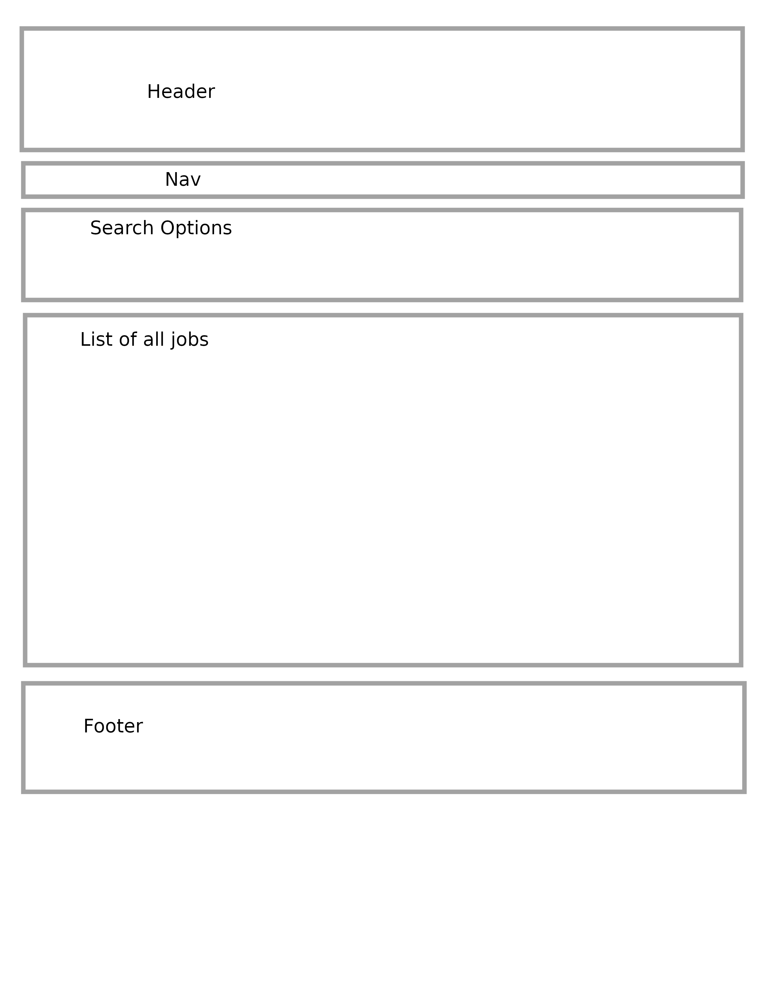
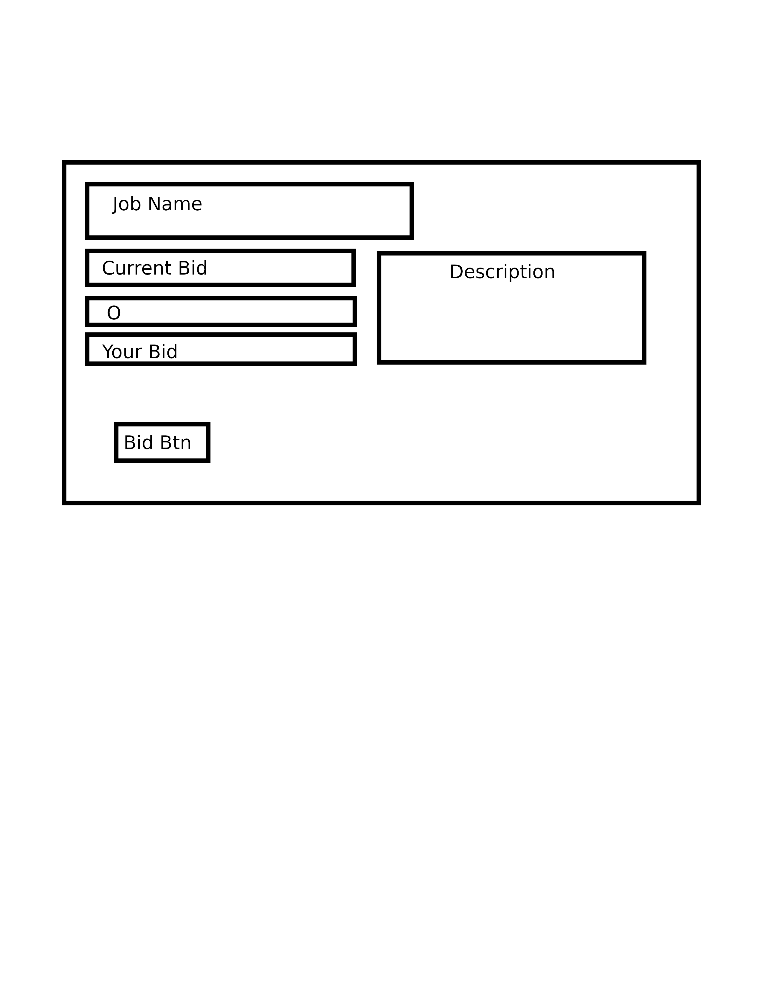
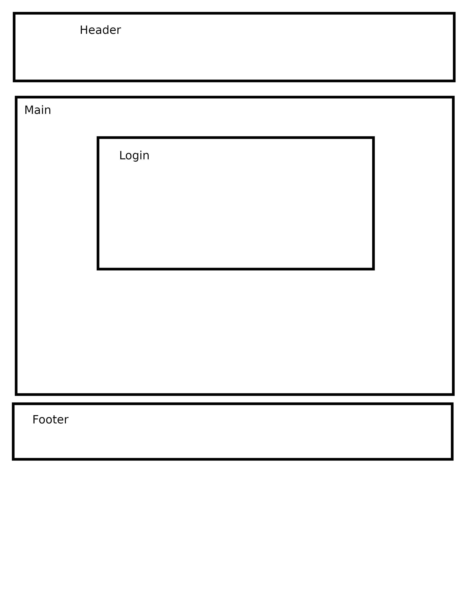

# 401 Final project
## Authors
- Natalie Alway
- Travis Skyles
- Trevor Thompson
- David Vloedman
# Problem Domain
Do you need help moving? mowing your lawn? setting up ikea furniture? There are not a lot of options to find handy help. Our application can assist you in your search to find handy people across the nation! Our application will allow a user to login or sign up using an Oauthorization process, once in our application that user will be able to post job requests. They will be able to have a role that can create a job, update the information, or delete the job posting. Other users are able to browse the job postings and "bid" to do the job.
Job management and bidding system
Our project aims to allow users to be able to post jobs. Other users can then post a bid to do the job. The creator can accept bids and then close the job.The user has privileges over their own jobs. Admin users also exist and have privileges to all jobs.
MVPs

# MVPs
1. When a user enters the page, present them with a login component.
2. A component for users to browse open jobs.
3. When a user is logged in, present them with a main dashboard showing them their jobs, a way to create jobs and ways to edit their jobs.
4. A component that presents a form that allows a user to create a new job.
5. A component that shows a detailed view of a particular job
6. On the detail view, a user can place a bid.
7. Have a slightly different super user dashboard with the ability to delete or edit any job within the database.
8. Have users be notified of activity through email on their jobs and jobs they have bid.
9. Dark mode/light mode options
10. Job history

# Stretch
* Graphs showing overall statistics of the entire application
* Add rating system to increase user credibility

# Instructions/Setup
[Setup](./Reactinstructions.md)

# Deployment
[CanU](https://401-backend.github.io/can-u-job-front-end/)
 
# Trello Board
[Trello](https://trello.com/b/7CutaFuI/canu)

# Requirements
* [User Stories](./user-stories.md)
* [Group Agreement](./group-agreement.md)
# Diagrams

## Data Flow

## Mock ups/Wire Frames
### Dashboard

### Main Job List

### Job Details Modal

### Login

